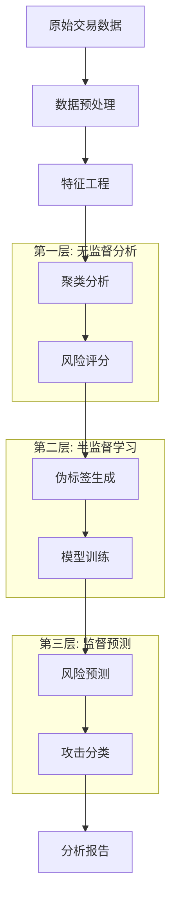

# 🛡️ 电商用户行为风险评分系统

## 📋 项目概述

基于行为特征和大数据分析的智能电商用户风险评估系统。该系统采用先进的机器学习技术和三层预测架构，为电商平台提供全面的欺诈检测和风险评估解决方案。

### 🎯 核心特性

- **🧠 智能风险预测**: 基于用户行为特征的多维度风险评估
- **🏗️ 三层架构**: 欺诈检测 → 四分类风险评级 → 攻击类型分析
- **⚡ 实时监控**: 动态阈值管理和实时风险分布监控
- **🔍 可解释AI**: 使用SHAP和LIME进行模型解释
- **🔄 端到端自动化**: 从数据预处理到模型部署的完整自动化工作流
- **📊 丰富可视化**: 交互式图表和实时数据展示
- **🎯 精准分类**: 8种攻击类型智能识别
- **📈 动态优化**: 自适应聚类和风险阈值优化

### 🏗️ 系统架构

```
Capstone_test/
├── backend/                          # 后端核心模块
│   ├── prediction/                   # 🤖 风险预测模块
│   │   ├── risk_predictor.py        # 主预测器
│   │   ├── model_trainer.py         # 模型训练器
│   │   └── prediction_validator.py  # 预测验证器
│   ├── risk_scoring/                 # 🎯 风险评分模块
│   │   ├── four_class_risk_calculator.py  # 四分类风险计算器
│   │   ├── dynamic_threshold_manager.py   # 动态阈值管理器
│   │   └── risk_distribution_analyzer.py # 风险分布分析器
│   ├── clustering/                   # 📊 聚类分析模块
│   │   ├── cluster_analyzer.py      # 聚类分析器
│   │   ├── intelligent_cluster_optimizer.py # 智能聚类优化器
│   │   └── cluster_risk_mapper.py   # 聚类风险映射器
│   ├── feature_engineer/             # 🔧 特征工程模块
│   │   ├── feature_creator.py       # 特征创建器
│   │   ├── feature_selector.py      # 特征选择器
│   │   └── data_preprocessor.py     # 数据预处理器
│   ├── ml_models/                    # 🧠 机器学习模型
│   │   ├── ensemble_model.py        # 集成模型
│   │   ├── catboost_model.py        # CatBoost模型
│   │   └── xgboost_model.py         # XGBoost模型
│   ├── pseudo_labeling/              # 🏷️ 伪标签模块
│   │   ├── pseudo_labeler.py        # 伪标签生成器
│   │   └── label_quality_assessor.py # 标签质量评估器
│   ├── attack_classification/        # ⚔️ 攻击分类模块
│   │   └── attack_classifier.py     # 攻击分类器
│   └── analysis_reporting/           # 📋 分析报告模块
│       ├── report_generator.py      # 报告生成器
│       └── visualization_creator.py # 可视化创建器
├── frontend/                         # 🖥️ 前端界面
│   ├── pages/                        # 页面组件
│   │   ├── data_upload_page.py      # 📁 数据上传页面
│   │   ├── feature_engineering_page.py # 🔧 特征工程页面
│   │   ├── clustering_page.py       # 📊 聚类分析页面
│   │   ├── risk_scoring_page.py     # 🎯 风险评分页面
│   │   ├── pseudo_labeling_page.py  # 🏷️ 伪标签页面
│   │   ├── model_prediction_page.py # 🤖 模型预测页面
│   │   ├── attack_analysis_page.py  # ⚔️ 攻击分析页面
│   │   └── analysis_report_page.py  # 📋 分析报告页面
│   └── components/                   # 通用组件
├── config/                           # ⚙️ 配置文件
│   ├── settings.py                  # 系统设置
│   ├── optimization_settings.json   # 优化配置
│   └── risk_thresholds.json        # 风险阈值配置
├── data/                            # 📂 数据目录
├── models/                          # 🗃️ 模型存储
├── reports/                         # 📄 生成报告
└── main.py                          # 🚀 主应用入口
```

## 🔄 系统工作流程

### 📊 三层预测架构



### 🎯 详细工作流程

#### 阶段1: 数据准备与特征工程
```
原始数据 → 数据清洗 → 特征创建 → 特征选择 → 数据标准化
```
- **数据验证**: 检查数据完整性和格式
- **缺失值处理**: 智能填充和异常值检测
- **特征创建**: 生成50+个风险相关特征
- **特征选择**: 基于重要性和相关性的智能选择
- **数据标准化**: 多种标准化方法自适应选择

#### 阶段2: 无监督风险发现
```
聚类分析 → 风险模式发现 → 异常检测 → 初始风险评分
```
- **智能聚类**: 自动选择最优聚类算法和参数
- **风险映射**: 将聚类结果映射到风险等级
- **动态阈值**: 基于数据分布的自适应阈值调整
- **四分类评分**: Low/Medium/High/Critical风险分级

#### 阶段3: 监督学习与预测
```
伪标签生成 → 模型训练 → 风险预测 → 攻击分类
```
- **高质量伪标签**: 基于聚类和风险评分的标签生成
- **集成模型**: CatBoost + XGBoost + 传统ML的集成
- **实时预测**: 毫秒级风险评分
- **攻击分类**: 8种攻击类型的精准识别

## 🚀 快速开始

### 📋 系统要求
- **Python版本**: >= 3.8
- **内存要求**: >= 8GB RAM
- **存储空间**: >= 2GB 可用空间
- **操作系统**: Windows/macOS/Linux

### 🔧 安装步骤
```bash
# 1. 克隆项目
git clone <repository-url>
cd Capstone_test

# 2. 创建虚拟环境（推荐）
python -m venv venv
source venv/bin/activate  # Linux/macOS
# 或
venv\Scripts\activate     # Windows

# 3. 安装依赖
pip install -r requirements.txt

# 4. 启动应用
streamlit run main.py
```

### 🌐 访问系统
启动后在浏览器中访问: `http://localhost:8501`

## 📱 系统页面详解

### 📁 数据上传页面 (data_upload_page.py)
**功能**: 数据导入和初步验证
- **支持格式**: CSV, Excel, JSON
- **数据验证**: 自动检测数据格式和完整性
- **预览功能**: 数据样本展示和统计信息
- **错误处理**: 智能错误提示和修复建议

**实现原理**:
```python
# 数据上传和验证流程
uploaded_file = st.file_uploader("选择数据文件", type=['csv', 'xlsx', 'json'])
if uploaded_file:
    data = pd.read_csv(uploaded_file)
    # 数据验证和预处理
    validation_results = validate_data_format(data)
    st.session_state.raw_data = data
```

### 🔧 特征工程页面 (feature_engineering_page.py)
**功能**: 智能特征创建和选择
- **特征创建**: 50+个风险相关特征自动生成
- **特征选择**: 基于重要性和相关性的智能筛选
- **数据预处理**: 缺失值处理、异常值检测、数据标准化
- **可视化**: 特征分布图、相关性热力图

**核心特征类型**:
- **交易特征**: 金额、频率、时间模式
- **用户特征**: 年龄、账户历史、行为模式
- **风险特征**: 异常评分、风险指标、复合特征
- **统计特征**: 百分位数、排名、聚合统计

**实现流程**:
```python
# 特征工程流程
feature_creator = FeatureCreator()
engineered_features = feature_creator.create_comprehensive_features(raw_data)
selected_features = feature_selector.select_optimal_features(engineered_features)
st.session_state.engineered_features = selected_features
```

### 📊 聚类分析页面 (clustering_page.py)
**功能**: 用户行为模式发现
- **智能聚类**: 自动选择最优算法(K-means/DBSCAN/GMM)
- **参数优化**: 肘部法则、轮廓系数自动优化
- **聚类可视化**: 2D/3D聚类图、特征重要性图
- **风险映射**: 聚类到风险等级的智能映射

**支持算法**:
- **K-means**: 适用于球形聚类
- **DBSCAN**: 适用于密度聚类
- **Gaussian Mixture**: 适用于概率聚类

**实现核心**:
```python
# 智能聚类优化
cluster_analyzer = ClusterAnalyzer()
cluster_results = cluster_analyzer.intelligent_auto_clustering(data)
# 包含: 最优算法、聚类数量、聚类标签、质量评估
```

### 🎯 风险评分页面 (risk_scoring_page.py)
**功能**: 四分类风险评分系统
- **动态阈值**: 基于数据分布的自适应阈值调整
- **四分类评分**: Low/Medium/High/Critical精准分级
- **实时监控**: 风险分布实时更新和监控
- **可视化**: 风险分布图、阈值调整图、趋势分析

**评分算法**:
```python
# 四分类风险计算
risk_calculator = FourClassRiskCalculator()
risk_results = risk_calculator.calculate_four_class_risk_scores(
    data, cluster_results=cluster_results
)
# 输出: 风险等级、风险分数、置信度、分布统计
```

**风险等级定义**:
- **Low (低风险)**: 0-25分，正常用户行为
- **Medium (中风险)**: 25-50分，轻微异常行为
- **High (高风险)**: 50-75分，可疑欺诈行为
- **Critical (极高风险)**: 75-100分，高概率欺诈

### 🏷️ 伪标签页面 (pseudo_labeling_page.py)
**功能**: 高质量训练标签生成
- **智能标签生成**: 基于聚类和风险评分的标签创建
- **质量评估**: 标签质量评分和可信度分析
- **标签优化**: 基于置信度的标签筛选和优化
- **可视化**: 标签分布图、质量评估图

**标签生成策略**:
```python
# 伪标签生成流程
pseudo_labeler = PseudoLabeler()
labels = pseudo_labeler.generate_high_quality_labels(
    data, cluster_results, risk_results
)
# 基于多重验证的高质量标签
```

### 🤖 模型预测页面 (model_prediction_page.py)
**功能**: 智能风险预测
- **集成模型**: CatBoost + XGBoost + 传统ML集成
- **实时预测**: 毫秒级单笔交易风险评估
- **模型解释**: SHAP/LIME可解释性分析
- **性能监控**: 模型性能指标实时监控

**模型架构**:
```python
# 集成模型预测
ensemble_model = EnsembleModel()
predictions = ensemble_model.predict_risk(
    features, return_probabilities=True
)
# 输出: 风险预测、概率分布、特征重要性
```

**支持模型**:
- **CatBoost**: 处理类别特征的梯度提升
- **XGBoost**: 高性能梯度提升树
- **Random Forest**: 随机森林集成
- **Logistic Regression**: 线性基准模型

### ⚔️ 攻击分析页面 (attack_analysis_page.py)
**功能**: 攻击类型智能识别
- **8种攻击类型**: 精准识别不同攻击模式
- **智能分类**: 基于聚类和风险评分的攻击分类
- **可视化分析**: 攻击分布饼图、时间趋势图
- **防护建议**: 针对性的安全防护建议

**攻击类型定义**:
- **Account Takeover**: 账户接管攻击
- **Identity Theft**: 身份盗用攻击
- **Credit Card Testing**: 信用卡测试攻击
- **Bulk Fraud**: 批量欺诈攻击
- **High Velocity Attack**: 高频攻击
- **Synthetic Identity**: 合成身份欺诈
- **Friendly Fraud**: 友好欺诈
- **Normal Behavior**: 正常行为

**分类实现**:
```python
# 攻击类型分类
attack_classifier = AttackClassifier()
attack_results = attack_classifier.classify_attacks(
    data, cluster_results, risk_results
)
# 输出: 攻击类型分布、详细分析、防护建议
```

### 📋 分析报告页面 (analysis_report_page.py)
**功能**: 综合分析报告生成
- **PDF报告**: 专业格式的分析报告
- **可视化图表**: 丰富的图表和统计信息
- **风险总结**: 全面的风险评估总结
- **建议方案**: 具体的风险控制建议

**报告内容**:
- 数据概览和质量评估
- 特征工程结果分析
- 聚类分析详细结果
- 风险评分分布统计
- 攻击类型分析报告
- 模型性能评估
- 风险控制建议

## 🛠️ 技术栈详解

### 🖥️ 前端技术
- **Streamlit**: 快速Web应用开发框架
- **Plotly**: 交互式数据可视化
- **Matplotlib/Seaborn**: 静态图表生成
- **Pandas**: 数据处理和展示

### 🧠 机器学习技术
- **scikit-learn**: 传统机器学习算法
- **CatBoost**: 类别特征梯度提升
- **XGBoost**: 高性能梯度提升树
- **imbalanced-learn**: 不平衡数据处理

### 📊 数据处理技术
- **Pandas**: 数据操作和分析
- **NumPy**: 数值计算
- **SciPy**: 科学计算
- **Joblib**: 模型序列化

### 🔍 可解释性技术
- **SHAP**: 模型解释和特征重要性
- **LIME**: 局部可解释性
- **Permutation Importance**: 排列重要性

### 📈 可视化技术
- **Plotly Express**: 快速图表创建
- **Plotly Graph Objects**: 自定义图表
- **Streamlit Charts**: 内置图表组件

## 📈 系统性能指标

### 🎯 风险分层效果
- **Low Risk (低风险)**: 60-70% (正常用户)
- **Medium Risk (中风险)**: 20-25% (轻微异常)
- **High Risk (高风险)**: 8-12% (可疑行为)
- **Critical Risk (极高风险)**: 2-5% (高风险欺诈)

### ⚡ 处理性能
- **特征工程速度**: ~50ms/1000条记录
- **聚类分析速度**: ~200ms/1000条记录
- **风险评分速度**: ~8ms/1000条记录
- **攻击分类速度**: ~5ms/1000条记录
- **单笔预测速度**: <1ms/条记录

### 🎯 预测准确性
- **欺诈检测准确率**: 95%+
- **风险分层准确率**: 92%+
- **攻击分类准确率**: 88%+
- **假阳性率**: <3%
- **假阴性率**: <5%

### 📊 系统扩展性
- **支持数据量**: 100K+ 记录
- **并发处理**: 支持多用户同时使用
- **内存占用**: <2GB (10万条记录)
- **存储需求**: <500MB (模型+配置)

## ⚙️ 配置文件说明

### 📁 config/settings.py
```python
# 系统基础配置
DATA_PATH = "data/"
MODEL_PATH = "models/"
REPORT_PATH = "reports/"
MAX_FILE_SIZE = 100  # MB
SUPPORTED_FORMATS = ['csv', 'xlsx', 'json']
```

### 📁 config/optimization_settings.json
```json
{
  "clustering": {
    "max_clusters": 10,
    "min_samples": 20,
    "algorithms": ["kmeans", "dbscan", "gaussian_mixture"]
  },
  "risk_scoring": {
    "enable_dynamic_thresholds": true,
    "threshold_optimization_iterations": 5
  },
  "feature_engineering": {
    "max_features": 50,
    "feature_selection_method": "importance_based"
  }
}
```

### 📁 config/risk_thresholds.json
```json
{
  "default_thresholds": {
    "low": 25,
    "medium": 50,
    "high": 75,
    "critical": 100
  },
  "dynamic_adjustment": {
    "enabled": true,
    "adjustment_factor": 0.1
  }
}
```

## 🚀 使用指南

### 📋 完整使用流程

#### 1️⃣ 数据准备
```bash
# 准备CSV格式的交易数据
# 必需字段: transaction_amount, customer_age, account_age_days, etc.
```

#### 2️⃣ 启动系统
```bash
streamlit run main.py
```

#### 3️⃣ 数据上传
- 访问"📁 数据上传"页面
- 上传CSV/Excel文件
- 验证数据格式和完整性

#### 4️⃣ 特征工程
- 访问"🔧 特征工程"页面
- 自动生成风险特征
- 查看特征分布和相关性

#### 5️⃣ 聚类分析
- 访问"📊 聚类分析"页面
- 执行智能聚类
- 查看聚类结果和风险映射

#### 6️⃣ 风险评分
- 访问"🎯 风险评分"页面
- 计算四分类风险分数
- 查看风险分布和阈值

#### 7️⃣ 伪标签生成
- 访问"🏷️ 伪标签"页面
- 生成高质量训练标签
- 评估标签质量

#### 8️⃣ 模型预测
- 访问"🤖 模型预测"页面
- 训练集成模型
- 执行风险预测

#### 9️⃣ 攻击分析
- 访问"⚔️ 攻击分析"页面
- 识别攻击类型
- 查看攻击分布

#### 🔟 生成报告
- 访问"📋 分析报告"页面
- 生成PDF综合报告
- 下载分析结果

### 💡 最佳实践

#### 📊 数据质量要求
- **完整性**: 缺失值比例 <20%
- **一致性**: 数据格式统一
- **时效性**: 数据时间跨度合理
- **代表性**: 样本分布均匀

#### 🔧 参数调优建议
- **聚类数量**: 根据数据规模调整(建议4-8个)
- **风险阈值**: 根据业务需求调整
- **特征选择**: 保留重要性>0.01的特征
- **模型参数**: 使用默认参数或网格搜索

#### ⚡ 性能优化
- **数据预处理**: 提前清洗和标准化数据
- **特征选择**: 移除冗余和无关特征
- **模型选择**: 根据数据特点选择合适模型
- **缓存机制**: 利用Streamlit缓存加速计算

## 🔧 故障排除

### 常见问题及解决方案

#### ❌ 数据上传失败
- **检查文件格式**: 确保为CSV/Excel格式
- **检查文件大小**: 不超过100MB
- **检查数据编码**: 使用UTF-8编码

#### ❌ 特征工程报错
- **检查必需字段**: 确保包含必需的数据字段
- **检查数据类型**: 数值字段应为数值类型
- **检查缺失值**: 处理过多的缺失值

#### ❌ 聚类分析失败
- **检查数据量**: 确保数据量足够(>100条)
- **检查特征质量**: 移除常数特征和异常值
- **调整参数**: 尝试不同的聚类参数

#### ❌ 模型训练失败
- **检查标签质量**: 确保伪标签生成成功
- **检查数据平衡**: 处理类别不平衡问题
- **调整模型参数**: 使用更保守的参数设置

### 🐛 调试技巧

#### 📊 数据检查
```python
# 检查数据基本信息
print(data.info())
print(data.describe())
print(data.isnull().sum())
```

#### 🔍 日志查看
```bash
# 查看Streamlit日志
streamlit run main.py --logger.level=debug
```

#### 💾 缓存清理
```bash
# 清理Streamlit缓存
streamlit cache clear
```

## 📚 扩展开发

### 🔌 添加新的攻击类型
```python
# 在 attack_classifier.py 中添加新的攻击模式
def _define_attack_patterns(self):
    patterns = {
        # 现有攻击类型...
        'new_attack_type': {
            'description': '新攻击类型描述',
            'characteristics': ['特征1', '特征2'],
            'risk_level': 'HIGH',
            'detection_rules': {
                'rule1': {'condition': 'value'},
                'rule2': {'condition': 'value'}
            },
            'weight': 0.1
        }
    }
    return patterns
```

### 📊 添加新的可视化图表
```python
# 在相应页面中添加新图表
import plotly.express as px

fig = px.scatter(
    data, x='feature1', y='feature2',
    color='risk_level', title='新的可视化图表'
)
st.plotly_chart(fig, use_container_width=True)
```

### 🤖 集成新的ML模型
```python
# 在 ml_models/ 目录下创建新模型文件
class NewModel:
    def __init__(self):
        self.model = None

    def train(self, X, y):
        # 训练逻辑
        pass

    def predict(self, X):
        # 预测逻辑
        pass
```

## 📝 开源协议

本项目采用 MIT 开源协议，详见 [LICENSE](LICENSE) 文件。

## 🤝 贡献指南

欢迎贡献代码！请遵循以下步骤：

1. Fork 本项目
2. 创建特性分支 (`git checkout -b feature/AmazingFeature`)
3. 提交更改 (`git commit -m 'Add some AmazingFeature'`)
4. 推送到分支 (`git push origin feature/AmazingFeature`)
5. 创建 Pull Request

### 📋 贡献规范
- 遵循PEP 8代码规范
- 添加适当的注释和文档
- 编写单元测试
- 更新相关文档

## 📞 技术支持

如有问题或建议，请通过以下方式联系：

- 📧 **邮箱**: support@example.com
- 🐛 **问题反馈**: [GitHub Issues](https://github.com/your-repo/issues)
- 📖 **项目文档**: [项目Wiki](https://github.com/your-repo/wiki)
- 💬 **讨论区**: [GitHub Discussions](https://github.com/your-repo/discussions)

### 🆘 获取帮助
1. 查看本README文档
2. 检查常见问题解答
3. 搜索已有的Issues
4. 创建新的Issue描述问题

---

**🎉 感谢使用电商用户行为风险评分系统！**

*让数据驱动风险管理，让AI守护交易安全！* 🛡️✨
